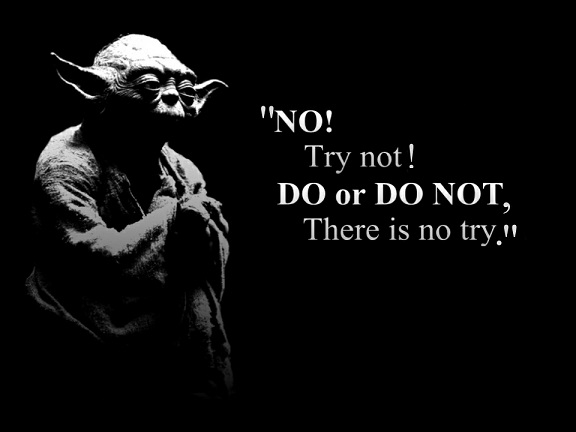

# Open Coding Notes
My notes on coding
started 2019.01.01

## The Basic Mindset

* Commit everyday, even if it is trivial commit.
* You can do it, it is a lot , but not exactly hard.
* Coding is a aquired skill, in the begining it is not a mental activity but a physical exersise.
* Don't give up, you don't have that option.
* Be patien, don't try to learn about everything you encounter.
* Protect your wrist , Protect your hand, Stay away from the mouse.

## The Basic Stratery

### Stage One: the basic
* learn the basic of python
* learn the basic of gitj and github
* learn the basic of markdown
* learn the basic of regax
* learn the basic of ubuntu-linux commandline bash
* make an English vocabulary training app for me and my wife
* pick up any information you find on your way
* make a simple blog and write your book in form of a blog articles.

### Stage Two 
* learn about what to learn in order to learn to make a website
* learn the basics of HTML5, CSS3, Javascript, Dango or Flask
* learn about the website holsting
* learn about the basic commandline bash for remote computer access.
* learn about the basic vector art.
* make a website that recommend movies based your tast.

## Stage Three
* Machine Learning? Statistics? Android? Rasberry Pie?

unknown Concepts collected:

Vim
zen coding
LaTax

known and learn:
